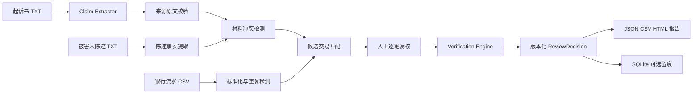

# V0.1 系统架构

## 1. 架构目标

V0.1 采用单工作流架构。大模型只负责起诉书付款主张的结构化提取，所有金额、去重、
候选匹配、状态汇总、版本和校验由确定性 Python 代码完成。

## 2. 分层

| 层 | 目录 | 职责 |
| --- | --- | --- |
| 领域层 | `src/legal_funds_agent/domain` | Pydantic对象、枚举和金额约束 |
| 解析层 | `parsers`、`services/*extractor.py` | 文本和CSV转为结构化事实 |
| 审查层 | `candidate_matcher.py`、`review_engine.py` | 候选召回和状态汇总 |
| 校验层 | `verification_engine.py` | 金额、重复、版本和引用强制校验 |
| 工作流层 | `workflow/vertical_slice.py` | 顺序编排、人工确认入口和失败日志 |
| 持久化层 | `persistence` | 可选SQLite版本与审计留痕 |
| 展示层 | `ui/streamlit_app.py` | 四页审查工作台和报告下载 |

## 3. 模型边界

`MockProvider`、`OpenAIProvider` 和 `DeepSeekProvider` 共享结构化接口。模型输出必须经过 Pydantic 校验，
并且 `source_text` 必须真实存在于输入原文；程序重新计算字符位置，不信任模型提供的偏移。
模型不能写数据库、计算金额、决定交易纳入状态或生成 `HUMAN_CONFIRMED`。

## 4. 决定版本

系统首先生成 `SYSTEM_PROPOSED v1`。首次人工复核生成 v2，后续修正依次生成 v3、v4，
每版通过 `supersedes_decision_id` 指向上一版。SQLite 对已存在决定执行不可变校验。

## 5. 安全边界

上传文件只在当前进程内解析，默认不保存。用户主动启用本地保存时，SQLite 只保存结构化
结果，不保存原文件，账号脱敏后写入。报告与界面同样只显示账号末四位。
